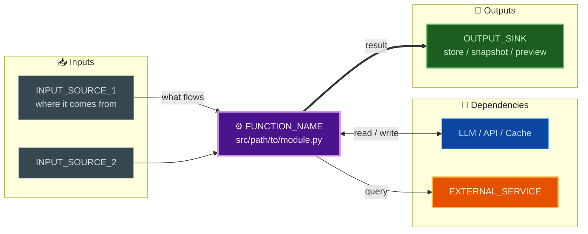

# NOit Documenting Data Flow

> **STAR diagram pieces → interactive viewer + overview**  
> By [NOit](https://noit2.com) — Architecture documentation that stays in sync.

[](https://pypi.org/project/noit-documenting-data-flow/)
[](https://opensource.org/licenses/MIT)
[](https://www.python.org/downloads/)

## What It Does

```
┌─────────────────────────────────────────────────────────────────┐
│  YOU WRITE THIS (once per function)                            │
│  ┌─────────────────────────────────────────────────────────┐   │
│  │ docs/architecture/diagrams/01-api-gateway.md              │   │
│  │ ```mermaid                                                │   │
│  │ graph LR                                                  │   │
│  │   hub["⚙️ handle_request()"]:::hub                        │   │
│  │   in1["📥 HTTP Request"]:::input                          │   │
│  │   dep1["🤖 Auth Service"]:::dep                           │   │
│  │   out1["💾 Response + Logs"]:::output                     │   │
│  │   in1 --> hub --> dep1 ==> out1                           │   │
│  │ ```                                                       │   │
│  └─────────────────────────────────────────────────────────┘   │
└─────────────────────────────────────────────────────────────────┘
                              │
                              ▼
┌─────────────────────────────────────────────────────────────────┐
│  GENERATOR CREATES THIS (automatically)                        │
│  ┌─────────────────────────────────────────────────────────┐   │
│  │ docs/architecture_diagrams.html  ← Interactive viewer    │   │
│  │ docs/architecture/OVERVIEW.md      ← High-level index    │   │
│  └─────────────────────────────────────────────────────────┘   │
└─────────────────────────────────────────────────────────────────┘
```

**Source of truth = Markdown pieces. Never hand-edit the HTML.**

## Features

| Feature | Description |
|---------|-------------|
| 🎯 **STAR Pattern** | Hub-and-spoke: function = center, inputs/deps/outputs = spokes |
| 🌙 **Dark Theme** | Consistent palette across MkDocs + generated viewer |
| 🔍 **Interactive** | Pan, zoom, fullscreen, fit-to-screen on every diagram |
| 📱 **Responsive** | Works on mobile, tablets, desktop |
| 🏷️ **Grouped Nav** | Filter by Infra / Ops / Sequences (configurable) |
| 🤖 **MCP Server** | AI agents can create/update diagrams via tools |
| 📦 **Zero Config** | Drop into any MkDocs Material project |
| 🎨 **Every Mermaid Interactive** | All `mermaid` fences get pan/zoom automatically |

## Quick Start

```bash
# Install
pip install noit-documenting-data-flow

# Or with MkDocs for full docs stack
pip install "noit-documenting-data-flow[docs]"

# Initialize in your project
noit-diagram-rollup init

# Add your first diagram piece
cp docs/architecture/diagrams/00-template.md docs/architecture/diagrams/01-my-api.md
# Edit 01-my-api.md with your function's data flow

# Generate the viewer
noit-diagram-rollup build --write

# Serve docs
mkdocs serve
# Open http://127.0.0.1:8000/architecture_diagrams.html
```

## MCP Server (for AI Agents)

Run the MCP server to let AI agents manage your diagrams:

```bash
# Stdio transport (for Claude Code, etc.)
noit-mcp-server

# Or HTTP transport
noit-mcp-server --transport http --port 8765
```

**Available Tools:**
| Tool | Description |
|------|-------------|
| `create_diagram_piece` | Create a new STAR diagram piece from template |
| `update_diagram_piece` | Update an existing piece |
| `list_diagram_pieces` | List all pieces with metadata |
| `build_viewer` | Generate the interactive HTML viewer |
| `get_diagram_piece` | Read a piece's content |

## Project Structure (after `init`)

```
your-project/
├── mkdocs.yml                    # Add: extra_javascript/css for interactive mermaid
├── docs/
│   ├── architecture_diagrams.html    # GENERATED - interactive viewer
│   ├── architecture/
│   │   ├── diagrams/
│   │   │   ├── .pages                    # Nav order (awesome-pages)
│   │   │   ├── rollup.manifest.yml       # Groups + badges
│   │   │   ├── 00-template.md            # STAR template (copy this)
│   │   │   ├── 01-your-function.md       # Your pieces go here
│   │   │   └── mermaid-style.md          # Dark palette reference
│   │   └── OVERVIEW.md                   # GENERATED - high-level index
│   ├── javascripts/
│   │   └── mermaid-interactive.js        # Makes ALL mermaid fences interactive
│   └── stylesheets/
│       └── mermaid-interactive.css       # Dark theme for interactive diagrams
├── scripts/
│   └── build_diagram_rollup.py           # Generator (also via CLI)
└── .claude/
    └── skills/
        └── documenting-data-flow/
            └── SKILL.md                  # Skill definition for agents
```

## STAR Diagram Template



**Rules:**
- One function = one hub = one piece (`.md` file)
- Use `<br/>` for line breaks (never `\n`)
- Use edge vocab: `-->` direct, `==>` pipeline, `-.->` async/optional, `<-->` bidirectional
- Register in `.pages` (nav order) and `rollup.manifest.yml` (group + badge)

## MkDocs Integration

Add to your `mkdocs.yml`:

```yaml
extra_javascript:
  - javascripts/mermaid-interactive.js
extra_css:
  - stylesheets/mermaid-interactive.css

plugins:
  - awesome-pages          # enables .pages nav
  - roamlinks              # enables [[wikilinks]]

markdown_extensions:
  - pymdownx.superfences:
      custom_fences:
        - name: mermaid
          class: mermaid
          format: !!python/name:pymdownx.superfences.fence_code_format
```

## CLI Reference

```bash
noit-diagram-rollup --help

Commands:
  init              Initialize diagram structure in current project
  build             Build viewer + overview (dry-run by default)
  validate          Validate all pieces have valid mermaid + required fields

Options:
  --diagrams-dir PATH     Diagrams folder (default: docs/architecture/diagrams)
  --manifest PATH         Manifest file (default: <diagrams-dir>/rollup.manifest.yml)
  --out-html PATH         Output HTML (default: docs/architecture_diagrams.generated.html)
  --out-overview PATH     Output overview (default: docs/architecture/diagrams/OVERVIEW.generated.md)
  --write                 Write to real paths (default: dry-run to temp dir)
  --template PATH         Viewer template (default: built-in dark template)
```

## MCP Tools Reference

```json
{
  "create_diagram_piece": {
    "slug": "my-api-handler",
    "title": "API Request Handler",
    "function_path": "src/api/handler.py",
    "group": "ops",
    "inputs": [{"id": "req", "label": "HTTP Request", "description": "JSON + headers"}],
    "dependencies": [{"id": "auth", "label": "Auth Service", "type": "extSvc"}],
    "outputs": [{"id": "resp", "label": "HTTP Response", "description": "JSON + status"}]
  }
}
```

Groups: `infra` (badge: infra), `ops` (badge: ops), `seq` (badge: seq)

## Configuration

Create `noit-diagram-rollup.yaml` in project root:

```yaml
diagrams_dir: "docs/architecture/diagrams"
manifest: "rollup.manifest.yml"
title: "My Project Architecture Diagrams"
subtitle: "Generated from STAR pieces"
groups:
  - id: "infra"
    label: "Infrastructure"
    badge: "infra"
  - id: "ops"
    label: "Operations"
    badge: "ops"
  - id: "seq"
    label: "Sequences"
    badge: "seq"
```

## Contributing

```bash
git clone https://github.com/noit/noit-documenting-data-flow
cd noit-documenting-data-flow
pip install -e ".[dev]"
pytest tests/
```

## License

MIT — © 2024 [NOit](https://noit2.com)

---

**Built by NOit** — Making architecture documentation effortless since 2024.  
🌐 [noit2.com](https://noit2.com) | 📧 hello@noit2.com